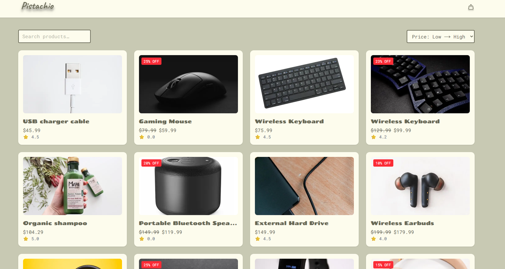

# Pistachio Online Shop

A fully-functional e-commerce demo built with Next.js and TypeScript as part of the JavaScript Frameworks course assignment. The goal is to practice modern React patterns, data fetching, client state, and accessible UI on a realistic shop.

---

## Description

Pistachio lets users browse products, view rich product details, and manage a simple cart with a friendly, responsive UI. It uses the Noroff public API (no auth required) and common production patterns like state persistence, form validation, and optimized images.

- Dynamic product pages with images, tags, description, price & discount
- Search and sort for quick product discovery
- Cart with increment/decrement/remove and a playful checkout success flow
- Contact form with client-side validation and helpful toasts

---

## 🚀 Features

- **Product Listing**  
  • Fetches products from the public API (`GET /online-shop`)  
  • Responsive grid of product cards with image, title, price (original & discounted), rating and discount badge
- **Product Details**  
  • Dynamic route at `/product/[id]`  
  • Displays full product info: images, title, description, tags, reviews  
  • “Add to Bag” button with success toast
- **Search & Sort**  
  • Real-time filtering by title  
  • Sort by price (asc/desc) or name (A→Z / Z→A)
- **Shopping Cart**  
  • Global cart state via Zustand persisted to `localStorage`  
  • Increment, decrement, or remove individual items with toasts  
  • Clear all & checkout flow → success page + toast
- **Contact Form**  
  • Client-side form with React Hook Form & TypeScript validation  
  • Fields: Full Name, Subject, Email, Message  
  • Validation toasts for success / failure
- **Styling & UX**  
  • Tailwind CSS v4 for utility-first styling  
  • Google Fonts via `next/font` – **Chango** for headings, **Roboto Mono** for body text  
  • Custom CSS variables for colors (`#C8C9B3` background, `#FDFCED` card, `#696956` text)  
  • Toast notifications with `react-hot-toast`  
  • Next.js `<Image>` optimized loading (configured in `next.config.js`)  
  • Mobile ↔ desktop responsive breakpoints

---

## Built With

- **Framework:** Next.js 15 + React 19  
- **Language:** TypeScript 5  
- **Styling:** Tailwind CSS 4  
- **State:** Zustand (with `persist`)  
- **Forms:** React Hook Form  
- **Notifications:** react-hot-toast  
- **HTTP:** axios

---

## Getting Started

### Installing

Clone the repo:
    git clone <YOUR-GITHUB-REPO-URL>
    cd jsframeworks

Install dependencies (use the lockfile if present):
    npm ci
    # or
    npm install

### Running

Start the dev server:
    npm run dev

Build and run for production:
    npm run build
    npm start

Your app will be available at http://localhost:3000.

## ⚙️ Configuration

**next.config.js**

    /** @type {import('next').NextConfig} */
    const nextConfig = {
      images: {
        remotePatterns: [
          {
            protocol: "https",
            hostname: "static.cloud.noroff.dev",
            port: "",
            pathname: "/api/online-shop/**",
          },
        ],
      },
    };
    export default nextConfig;

### Fonts (`src/lib/fonts.ts`)

    import { Chango, Roboto_Mono } from "next/font/google";

    interface NextFontWithVar {
      className: string;
      variable: string;
    }

    export const chango = Chango({
      subsets: ["latin"],
      weight: "400",
      variable: "--font-chango",
    }) as NextFontWithVar;

    export const robotoMono = Roboto_Mono({
      subsets: ["latin"],
      weight: ["400", "700"],
      variable: "--font-roboto-mono",
    }) as NextFontWithVar;

## 🔗 API Endpoints

- **All products**: `GET https://v2.api.noroff.dev/online-shop`
- **Single product**: `GET https://v2.api.noroff.dev/online-shop/:id`

_No API key or auth needed._

## 🚀 Deployment

Deploy easily to Vercel or Netlify:

1. Push your repo to GitHub.
2. Create a new project in Vercel or Netlify and link your repository.
3. Use the default Next.js build settings:
   
       npm run build

4. Deploy!

## 📝 Project Structure

    src/
    ├─ app/
    │  ├─ layout.tsx               # Root layout + Toaster
    │  ├─ page.tsx                 # Home (with client wrapper)
    │  ├─ cart/page.tsx            # Cart page (client)
    │  └─ product/[id]/page.tsx    # Product details
    ├─ components/
    │  ├─ Header.tsx
    │  ├─ Footer.tsx
    │  ├─ ProductCard.tsx
    │  ├─ AddToCartButton.tsx
    │  ├─ SearchBar.tsx
    │  └─ SortDropdown.tsx
    ├─ lib/
    │  ├─ productApi.ts
    │  ├─ cartStore.ts
    │  └─ fonts.ts
    └─ styles/
       └─ globals.css

## Built With

- Next.js 15
- React 19
- TypeScript 5
- Tailwind CSS 4
- Zustand (persist)
- React Hook Form
- react-hot-toast
- axios

## Contributing

This is a small educational project. If you want to contribute:

1. Open an issue describing the change.
2. Create a feature branch from `main`.
3. Keep commits focused and include clear messages.
4. Open a pull request for review.

Thank you for keeping the code clean and accessible 💚

## Contact

- Portfolio: https://idatoldportfolio.netlify.app/
- LinkedIn: <https://www.linkedin.com/in/ida-charlotte-loriann-toldn%C3%A6s-920190117/>
- Email: <idatoldnaes@icloud.com>

## License

This repository is for educational purposes. If you plan to reuse parts of the code, please credit the author.  
Add a LICENSE file (e.g., MIT) if you intend to open-source it.

## Acknowledgments

- Noroff API team for the public `online-shop` endpoints  
- Next.js & Vercel for excellent tooling and docs  
- React Hook Form, Zustand, and Tailwind communities for great DX  
- Classmates and instructors for feedback and inspiration
